# Sistema de Índice Real de Precios al Consumidor (IRPC)

## Objetivo del Sistema

El sistema **IRPC** (Índice Real de Precios al Consumidor) tiene como objetivo **publicar la información del índice real de precios de productos al consumidor de un país**. Esta información se basa en los **precios de productos de consumo proporcionados por decenas de voluntarios**. Nuestro objetivo es conocer el índice real de precios al consumidor. El sitio web es mantenido por cientos de personas que colaboran voluntariamente aportando los precios de los productos y servicios.

## Tecnología y Arquitectura

El sistema utiliza un **stack tecnológico moderno** que incluye **Supabase, Next.js, D3.js y Vercel**.

*   **Supabase** actúa como un **backend-as-a-service**, proporcionando una instancia completa de PostgreSQL, APIs auto-generadas, autenticación, funciones *edge* y capacidades en tiempo real.
*   **Next.js**, un *framework* de React, se elige por su arquitectura *server-first* y su *App Router*, lo que permite una **obtención segura de datos y renderizado del lado del servidor (SSR)**, mejorando el rendimiento y la seguridad.
*   **D3.js** (Data-Driven Documents) es la librería JavaScript principal para la **visualización de datos**, ofreciendo flexibilidad para crear gráficos interactivos y personalizados.
*   **Vercel** es la plataforma de *hosting* preferida para el despliegue, ofreciendo un flujo de trabajo de despliegue sin interrupciones y una infraestructura optimizada para aplicaciones Next.js.

### Diagrama de Flujo de Peticiones (Diagrama de Secuencia)

El flujo de peticiones se organiza de la siguiente manera:

1.  El **Usuario** accede a la aplicación **Frontend Next.JS**.
2.  El **Frontend Next.JS** carga recursos estáticos desde **Vercel CDN**, que son entregados de vuelta al *frontend*.
3.  El **Frontend Next.JS** solicita datos de inflación a la **Supabase API**.
4.  La **Supabase API** consulta a la **Supabase DB** y retorna los datos al *frontend* en formato JSON.
5.  El **Frontend Next.JS** renderiza gráficos con D3.js utilizando estos datos.
6.  El **Usuario** envía un formulario de precios al **Frontend Next.JS**.
7.  El **Frontend Next.JS** envía los datos con autenticación a la **Supabase API**.
8.  La **Supabase API** inserta el registro en la tabla de precios de la **Supabase DB** y confirma la inserción.
9.  La **Supabase API** confirma el éxito al *frontend*.
10. El **Frontend Next.JS** solicita un cálculo de inflación (asíncrono) a los **Microservicios (Cálculos)**.
11. Los **Microservicios** leen precios para el cálculo de la **Supabase DB**, que retorna los datos.
12. Los **Microservicios** calculan la inflación anualizada.
13. Los **Microservicios** guardan los resultados en la **Supabase DB**, que confirma el guardado.
14. Los **Microservicios** notifican la finalización (opcional) al *frontend*.

**Nota**: Los cálculos pesados se ejecutan vía *cron jobs* o funciones *serverless*.

### Integración de Supabase con Next.js

La implementación de Supabase en Next.js App Router requiere dos clientes diferenciados:

*   **Cliente de Servidor (src/lib/supabase/server.ts)**: Se utiliza en *Server Components*, *Server Actions* y *Route Handlers*. Emplea `createServerClient` de `@supabase/ssr` y se integra con la función `cookies` de `next/headers` para gestionar tokens de autenticación en *cookies* y mantener sesiones de usuario.
*   **Cliente de Cliente (src/lib/supabase/client.ts)**: Para uso en *Client Components* (que se ejecutan en el navegador). Utiliza `createBrowserClient` de `@supabase/ssr`.

Esta separación asegura que la gestión de sesiones y el acceso a datos se manejen adecuadamente en cada entorno.

### Componentes de Servidor y Cliente en Next.js

Next.js App Router introduce un modelo de componentes dual:

*   **Server Components**: Se renderizan exclusivamente en el servidor, permitiendo acceso seguro a recursos de *backend* (bases de datos, APIs) y uso de secretos exclusivos del servidor. No permiten `useState`, `useEffect` ni acceso a APIs del navegador (`window`, `document`).
*   **Client Components**: Se designan explícitamente con `'use client'` al principio del archivo. Permiten interactividad del lado del cliente, gestión de estado con *hooks* de React y acceso completo a APIs del navegador.

Los datos obtenidos en un *Server Component* se pasan a un *Client Component* a través de *props*, que deben ser serializables.

### Visualización de Datos con D3.js

Para la visualización, se instala la librería D3.js y sus tipos TypeScript. El componente de visualización, `CpiChart`, es un *Client Component* y utiliza `useRef` para referenciar un elemento SVG y `useEffect` para integrar la lógica de D3.js. D3.js manipula directamente el DOM dentro de este contenedor SVG, mientras React maneja el Virtual DOM.

El gráfico de líneas dinámico se construye definiendo dimensiones, márgenes, parseando los datos de período a objetos `Date`, y utilizando escalas `d3.scaleTime` (para el eje X) y `d3.scaleLinear` (para el eje Y). Se generan ejes con `d3.axisBottom` y `d3.axisLeft` y una función `d3.line()` para dibujar la línea principal.

También se implementan **tooltips interactivos** para mejorar la experiencia del usuario. Estos tooltips se activan con eventos *mouseover* y *mousemove*, mostrando información detallada del punto de datos más cercano al cursor, y se ocultan con *mouseout*.

## Despliegue en Producción con Vercel

El despliegue se realiza conectando el proyecto local a un repositorio Git (ej. GitHub) y luego importándolo en el *dashboard* de Vercel. Vercel detecta automáticamente el proyecto Next.js y aplica las configuraciones óptimas.

Las **variables de entorno de producción para Supabase** (NEXT_PUBLIC_SUPABASE_URL y NEXT_PUBLIC_SUPABASE_ANON_KEY) se configuran en la sección "Environment Variables" del *dashboard* de Vercel. Vercel las encripta y las inyecta de forma segura durante el proceso de *build*.

El **despliegue es automático**: cualquier *commit* a la rama principal del repositorio conectado (ej. `main` o `master`) dispara un nuevo despliegue en producción, que puede ser monitoreado en el *dashboard* de Vercel. Una vez completado, Vercel asigna una URL pública a la aplicación.

## Contenido de la Página Inicial

La página inicial mostrará:

*   El texto: "**Índice Real de Precios al Consumidor en [País] : [Valor]%**" (donde [País] es una variable y [Valor] es un valor de la base de datos, por ejemplo: **14.68% anual**).
*   Una **gráfica de tiempo** (eje horizontal) vs. **porcentaje de inflación** (eje vertical). Mostrará los **últimos 36 meses** de información, el índice de aumento del mes natural y la línea del porcentaje de inflación promedio de los últimos 12 meses.
*   Debajo de la gráfica principal, un **carrusel con fotos de productos con cambios importantes de precio**, mostrando el precio anterior y el actual para dar constancia del cambio.
*   Un número de **WhatsApp (+525555555555)** para que los usuarios envíen fotos de precios.
*   Información sobre el sistema, por ejemplo, "Contamos con **25,670 fotos de los precios de 167 productos y servicios en México**."
*   Opciones para ver historial de precios, países disponibles (México, Argentina, Colombia, Guatemala, El Salvador, Honduras, Perú), enlaces a redes sociales (Instagram, X/Twitter), formas de ayuda (ser voluntario, donar dinero) y la metodología usada.

## Página de Estadística de un Producto

*   Mostrará el **nombre del producto y país**.
*   Arriba de la gráfica, el **índice real de precios de ese producto**.
*   Debajo, una **gráfica con varias líneas**; cada línea representa la información de precio del producto en un mismo comercio y lugar. El eje vertical es el precio, el eje horizontal es el tiempo.
*   Botón "**Descargar datos**" para acceder a la URL de la API con información e URLs de imágenes.
*   Un **carrusel de evidencias con fotografías de los precios**.
*   Todos los productos activos con más de una línea de precios podrán mostrar su contenido en esta página.

## Panel del Webmaster

El panel del webmaster permite gestionar el sistema, incluyendo:

*   **Gestión de Voluntarios**: Dar de alta, editar (nombre, WhatsApp, país, suspender), gestionar retiros de puntos.
    *   Al dar de alta un voluntario, se inserta en `users.auth` y `voluntarios`, se crea un registro en `finanzas` con "Saldo inicial" de 0, y se envía un correo de bienvenida con credenciales.
    *   La edición de voluntarios actualiza la tabla `voluntarios`.
*   **Gestión de Productos**: Dar de alta, editar (nombre, categoría, foto, comercios asociados, activar/desactivar).
*   **Gestión de Categorías**: Dar de alta (nombre, rama asociada). Las nuevas categorías se aplican a todos los países. Se inserta en la tabla `categorias` y se asigna una proporción por defecto de 1 en la tabla `proporciones` para cada `proporcion_id` existente.
*   **Gestión de Comercios**: Dar de alta (nombre, país, categorías que vende), editar (nombre, categorías que vende).
    *   Al agregar un comercio, se inserta en `comercios` y se inserta un registro en `comercios_categorias` por cada relación activa.
    *   Al editar un comercio, se actualiza `comercios` y se gestionan las relaciones en `comercios_categorias` (insertar nuevas, eliminar las no activas).
*   **Administrar Criterios de Cálculo**: Agregar nuevos criterios (nombre corto, descripción amplia, importancia, ponderación numérica por categoría), editar criterios existentes. El criterio con mayor importancia aparece en la página principal.

## Panel del Voluntario

### Login y Recuperación de Contraseña

Los voluntarios acceden con correo y contraseña. Pueden solicitar una nueva contraseña, que se les enviará por correo. También se ofrece la opción de contactar por WhatsApp para ser voluntario.

### Principal

Muestra el **saldo actual de puntos acumulados** del voluntario.

*   Si hay productos en seguimiento que requieren actualización (más de un mes sin actualizar), se listan con un botón "Hacer".
*   Si todos los productos están actualizados, se muestra un mensaje de felicitación y se invita a agregar más productos.
*   Opciones para "Agregar productos", "Retirar mis puntos acumulados" y "Cerrar sesión".

### Actualizar Precio

Los voluntarios pueden actualizar el precio de un producto específico, mostrando la foto del producto y los últimos 5 precios anteriores.

*   Se introduce el **precio actual**, la **fecha** y se sube una **foto de evidencia**.
*   **Acciones**: Se inserta el registro en la tabla `precios`, se recalculan los índices de precios para ese producto/lugar y se actualiza `indices_productos`. Se agrega **1 punto adicional al voluntario** en la tabla `finanzas` por la actualización.
*   Se muestra un mensaje de agradecimiento y el nuevo saldo de puntos.
*   Opción para "**Ya no quiero dar seguimiento de este producto**", que desactiva el seguimiento.

### Agregar un Producto

Permite a los voluntarios seleccionar productos para dar seguimiento mensual de sus precios.

*   Filtros por país, lugar y comercio (con valores por defecto basados en la actividad del voluntario).
*   Lista de productos ordenada por rama/categoría, **evitando listar productos ya actualizados en los últimos dos meses** para esa combinación de lugar y comercio.
*   **Acciones**: Se insertan registros en la tabla `seguimiento` para cada producto seleccionado. Se muestra un mensaje de agradecimiento.

### Cron de Aviso al Voluntario

Un cron envía un correo diario a los voluntarios activos con productos en seguimiento que no han sido actualizados en más de 30 días.

*   Incluye el **saldo actual de puntos** del voluntario.
*   Muestra el **Índice Real de Precios al Consumidor** para el país del voluntario.
*   Lista los productos que necesitan actualización, con enlaces directos.
*   Invita a invitar a más voluntarios.

### Retirar Puntos Acumulados

Permite a los voluntarios solicitar el retiro de puntos, convertidos en tokens IRPC, a una dirección de la red Polygon.

*   Muestra el **saldo actual de puntos**.
*   El voluntario introduce la **cantidad de puntos** y la **dirección de la red Polygon**.
*   **Validaciones**: La cantidad solicitada no debe exceder el saldo actual.
*   **Acciones**: Si es válido, se inserta un registro en `finanzas` disminuyendo el saldo y se crea un registro en `retiros`. Se muestra un mensaje indicando que la solicitud está en proceso (manual, 1 a 72 horas) y se publican los últimos 10 registros del historial de retiros del usuario.

## Estructura de la Base de Datos (Supabase)

La base de datos del sistema IRPC está diseñada en Supabase, utilizando una instancia de PostgreSQL, y define un esquema robusto para gestionar la información de precios, voluntarios, cálculos de inflación y otros datos relevantes. Por defecto, Supabase habilita la Seguridad a Nivel de Fila (RLS) en las tablas nuevas, lo que requiere la definición explícita de políticas de acceso para cada tabla, incluyendo el acceso público de lectura.

A continuación, se detalla la estructura de las tablas principales, priorizando los nombres del esquema de base de datos `public.cpi_` y complementando con los detalles de las otras fuentes:

*   **`public.cpi_users`**: Esta tabla es un reflejo de la tabla `auth.users` de Supabase y almacena los identificadores (`user_id` de tipo UUID y `email` de tipo TEXT) de los usuarios con credenciales en el sistema, sirviendo como base para otras tablas que necesitan referenciar a un usuario.
*   **`public.cpi_countries`**: Almacena la información de los países donde opera el sistema IRPC, incluyendo un `country_id` (BIGINT, autoincremental), `country_name` (TEXT único) y `currency` (TEXT). En otra fuente, se le denomina `paises` y contiene `pais_id`, `país` y `moneda`.
*   **`public.cpi_branches`**: Guarda información sobre las ramas económicas a las que se relacionarán las categorías de productos. Incluye `branch_id` (BIGINT, autoincremental) y `branch_name` (TEXT único). También se le conoce como `ramas`, con campos `rama_id` y `rama`.
*   **`public.cpi_volunteers`**: Extiende la información de los usuarios que actúan como voluntarios. Contiene `user_id` (UUID, FK a `public.cpi_users`), `email` (TEXT único), `name` (TEXT), `whatsapp` (TEXT), `country_id` (BIGINT, FK a `public.cpi_countries`) y `suspended` (BOOLEAN, por defecto FALSE). Esta tabla se corresponde con `voluntarios`.
*   **`public.cpi_finances`**: Lleva la contabilidad de los puntos acumulados por cada voluntario. Registra `finance_id` (BIGINT, autoincremental), `user_id` (UUID, FK a `public.cpi_users`), `concept` (TEXT), `date` (TIMESTAMPTZ, por defecto `NOW()`), `previous_balance` (NUMERIC), `amount` (NUMERIC) y `current_balance` (NUMERIC). Se le llama `finanzas` en otra sección.
*   **`public.cpi_withdrawals`**: Registra las solicitudes de retiro de puntos por parte de los voluntarios. Incluye `withdrawal_id` (BIGINT, autoincremental), `user_id` (UUID, FK a `public.cpi_users`), `amount` (NUMERIC), `concept` (TEXT), `request_date` (TIMESTAMPTZ), `finance_id` (BIGINT, FK a `public.cpi_finances`) y `sent_date` (TIMESTAMPTZ, por defecto NULL). Equivale a la tabla `retiros`.
*   **`public.cpi_locations`**: Guarda información sobre estados, departamentos o lugares dentro de un país. Contiene `location_id` (BIGINT, autoincremental), `country_id` (BIGINT, FK a `public.cpi_countries`), `location_name` (TEXT) y `population` (INTEGER). Es conocida como `lugares`.
*   **`public.cpi_categories`**: Almacena información sobre las categorías de productos. Cada categoría (`category_id` BIGINT, autoincremental; `category_name` TEXT) está relacionada con una rama económica (`branch_id` BIGINT, FK a `public.cpi_branches`) y puede ser marcada como esencial (`is_essential_category` BOOLEAN, por defecto FALSE). Su equivalente es `categorias`.
*   **`public.cpi_establishments`**: Guarda información sobre los comercios o establecimientos. Incluye `establishment_id` (BIGINT, autoincremental), `country_id` (BIGINT, FK a `public.cpi_countries`) y `establishment_name` (TEXT). Se le refiere como `comercios`.
*   **`public.cpi_establishment_categories`**: Relaciona qué categorías de productos maneja cada comercio. Contiene `establishment_category_id` (BIGINT, autoincremental), `establishment_id` (BIGINT, FK a `public.cpi_establishments`) y `category_id` (BIGINT, FK a `public.cpi_categories`). En otra fuente, es `comercios_categorias`.
*   **`public.cpi_products`**: Almacena detalles sobre productos específicos a seguir. Sus campos son `product_id` (BIGINT, autoincremental), `country_id` (BIGINT, FK a `public.cpi_countries`), `category_id` (BIGINT, FK a `public.cpi_categories`), `product_name` (TEXT), `product_photo_url` (TEXT) y `is_active_product` (BOOLEAN). Se corresponde con `productos`.
*   **`public.cpi_tracking`**: Guarda qué productos específicos, en qué lugares y comercios, son seguidos por cada voluntario. Contiene `tracking_id` (BIGINT, autoincremental), `country_id` (BIGINT, FK a `public.cpi_countries`), `product_id` (BIGINT, FK a `public.cpi_products`), `location_id` (BIGINT, FK a `public.cpi_locations`), `establishment_id` (BIGINT, FK a `public.cpi_establishments`), `user_id` (UUID, FK a `public.cpi_users`) y `is_active_tracking` (BOOLEAN). Su nombre equivalente es `seguimiento`.
*   **`public.cpi_prices`**: Almacena los precios de los productos aportados por los voluntarios. Incluye `price_id` (BIGINT, autoincremental), `product_id` (BIGINT, FK a `public.cpi_products`), `location_id` (BIGINT, FK a `public.cpi_locations`), `establishment_id` (BIGINT, FK a `public.cpi_establishments`), `user_id` (UUID, FK a `public.cpi_users`), `price_value` (NUMERIC(10, 2)), `date` (DATE), `price_photo_url` (TEXT), `is_valid` (BOOLEAN, por defecto TRUE) y `analyzed_date` (TIMESTAMPTZ). Es la tabla `precios`.
*   **`public.cpi_criteria`**: Guarda los criterios o metodologías de evaluación para el cálculo de la inflación. Incluye `criterion_id` (BIGINT, autoincremental), `criterion_name` (TEXT único), `criterion_description` (TEXT), `is_active_criterion` (BOOLEAN, por defecto TRUE) y `acceptance_score` (NUMERIC). También se le conoce como `criterios`.
*   **`public.cpi_annual_product_location_establishment_inflation`**: Almacena los resultados del cálculo de la inflación anualizada para un producto, lugar y comercio específicos. Contiene `aple_inflation_id` (BIGINT, autoincremental), `recent_price_id` (BIGINT, FK a `public.cpi_prices`), `product_id` (BIGINT, FK a `public.cpi_products`), `country_id` (BIGINT, FK a `public.cpi_countries`), `location_id` (BIGINT, FK a `public.cpi_locations`), `establishment_id` (BIGINT, FK a `public.cpi_establishments`), `recent_date` (DATE), `historical_date` (DATE), `days_between_measurements` (INTEGER), `recent_price_value` (NUMERIC), `historical_price_value` (NUMERIC) y `aple_inflation_rate` (NUMERIC, por defecto NULL). Otra fuente la llama `inflacion_anual_plc`.
*   **`public.cpi_category_location_inflation`**: Almacena el promedio de la inflación anualizada de productos de la misma categoría y lugar. Los cálculos se basan en precios recabados en el mismo mes natural y son actualizados por un cron. Sus campos son `cli_id` (BIGINT, autoincremental), `country_id` (BIGINT, FK a `public.cpi_countries`), `category_id` (BIGINT, FK a `public.cpi_categories`), `location_id` (BIGINT, FK a `public.cpi_locations`), `cli_inflation_rate` (NUMERIC, por defecto NULL), `update_date` (TIMESTAMPTZ, por defecto `NOW()`), `month` (INTEGER) y `year` (INTEGER). Se le conoce como `inflacion_categoria_lugar`.
*   **`public.cpi_category_inflation`**: Almacena el promedio de la inflación anualizada de productos de la misma categoría, ponderado por la población de los lugares, para un país y mes natural dados. Es actualizado por un cron. Incluye `ci_id` (BIGINT, autoincremental), `country_id` (BIGINT, FK a `public.cpi_countries`), `category_id` (BIGINT, FK a `public.cpi_categories`), `ci_inflation_rate` (NUMERIC, por defecto NULL), `update_date` (TIMESTAMPTZ, por defecto `NOW()`), `month` (INTEGER) y `year` (INTEGER). También se llama `inflacion_categoria`.
*   **`public.cpi_weights`**: Guarda la ponderación o peso de cada categoría en relación con un criterio de evaluación específico. Contiene `weight_id` (BIGINT, autoincremental), `criterion_id` (BIGINT, FK a `public.cpi_criteria`), `category_id` (BIGINT, FK a `public.cpi_categories`) y `weight_value` (NUMERIC, por defecto 1). Es la tabla `ponderaciones`.
*   **`public.cpi_real_cpi`**: Almacena los resultados mensuales de la tasa de inflación real de precios al consumidor para cada país y según cada criterio de evaluación. Sus campos son `real_cpi_id` (BIGINT, autoincremental), `country_id` (BIGINT, FK a `public.cpi_countries`), `criterion_id` (BIGINT, FK a `public.cpi_criteria`), `real_cpi_inflation_rate` (NUMERIC, por defecto NULL), `update_date` (TIMESTAMPTZ, por defecto `NOW()`), `month` (INTEGER) y `year` (INTEGER). Otra sección se refiere a ella como `inflacion_real`.

**Consideraciones sobre Nomenclatura:**

Es importante notar que el esquema de base de datos (`IRPC: Esquema de base de datos`) utiliza una convención de nombres con el prefijo `public.cpi_` (por ejemplo, `public.cpi_users`), mientras que la descripción de la interfaz de usuario y funcionalidad (`Índice de precios real`) se refiere a las tablas con nombres más cortos y en español (por ejemplo, `voluntarios` o `paises`). Ambos conjuntos de nombres se refieren a las mismas estructuras de datos.

### Diagrama entidad relación

```mermaid
erDiagram
    public_cpi_users {
        user_id UUID
        email VARCHAR
    }

    public_cpi_countries {
        country_id BIGINT
        country_name VARCHAR
        currency VARCHAR
    }

    public_cpi_branches {
        branch_id BIGINT
        branch_name VARCHAR
    }

    public_cpi_volunteers {
        user_id UUID
        email VARCHAR
        name VARCHAR
        whatsapp VARCHAR
        country_id BIGINT
        suspended BOOLEAN
    }

    public_cpi_finances {
        finance_id BIGINT
        user_id UUID
        concept VARCHAR
        date DATETIME
        previous_balance NUMERIC
        amount NUMERIC
        current_balance NUMERIC
    }

    public_cpi_withdrawals {
        withdrawal_id BIGINT
        user_id UUID
        amount NUMERIC
        concept VARCHAR
        request_date DATETIME
        finance_id BIGINT
        sent_date DATETIME
    }

    public_cpi_locations {
        location_id BIGINT
        country_id BIGINT
        location_name VARCHAR
        population INT
    }

    public_cpi_categories {
        category_id BIGINT
        branch_id BIGINT
        category_name VARCHAR
        is_essential_category BOOLEAN
    }

    public_cpi_establishments {
        establishment_id BIGINT
        country_id BIGINT
        establishment_name VARCHAR
    }

    public_cpi_establishment_categories {
        establishment_category_id BIGINT
        establishment_id BIGINT
        category_id BIGINT
    }

    public_cpi_products {
        product_id BIGINT
        country_id BIGINT
        category_id BIGINT
        product_name VARCHAR
        product_photo_url VARCHAR
        is_active_product BOOLEAN
    }

    public_cpi_tracking {
        tracking_id BIGINT
        country_id BIGINT
        product_id BIGINT
        location_id BIGINT
        establishment_id BIGINT
        user_id UUID
        is_active_tracking BOOLEAN
    }

    public_cpi_prices {
        price_id BIGINT
        product_id BIGINT
        location_id BIGINT
        establishment_id BIGINT
        user_id UUID
        price_value NUMERIC
        date DATE
        price_photo_url VARCHAR
        is_valid BOOLEAN
        analyzed_date DATETIME
    }

    public_cpi_criteria {
        criterion_id BIGINT
        criterion_name VARCHAR
        criterion_description VARCHAR
        is_active_criterion BOOLEAN
        acceptance_score NUMERIC
    }

    public_cpi_annual_product_location_establishment_inflation {
        aple_inflation_id BIGINT
        recent_price_id BIGINT
        product_id BIGINT
        country_id BIGINT
        location_id BIGINT
        establishment_id BIGINT
        recent_date DATE
        historical_date DATE
        days_between_measurements INT
        recent_price_value NUMERIC
        historical_price_value NUMERIC
        aple_inflation_rate NUMERIC
    }

    public_cpi_category_location_inflation {
        cli_id BIGINT
        country_id BIGINT
        category_id BIGINT
        location_id BIGINT
        cli_inflation_rate NUMERIC
        update_date DATETIME
        month INT
        year INT
    }

    public_cpi_category_inflation {
        ci_id BIGINT
        country_id BIGINT
        category_id BIGINT
        ci_inflation_rate NUMERIC
        update_date DATETIME
        month INT
        year INT
    }

    public_cpi_weights {
        weight_id BIGINT
        criterion_id BIGINT
        category_id BIGINT
        weight_value NUMERIC
    }

    public_cpi_real_cpi {
        real_cpi_id BIGINT
        country_id BIGINT
        criterion_id BIGINT
        real_cpi_inflation_rate NUMERIC
        update_date DATETIME
        month INT
        year INT
    }

    public_cpi_users ||--o| public_cpi_volunteers : "es voluntario"
    public_cpi_users ||--o{ public_cpi_finances : "tiene finanzas"
    public_cpi_users ||--o{ public_cpi_withdrawals : "solicita retiro"
    public_cpi_users ||--o{ public_cpi_prices : "aporta precio"
    public_cpi_users ||--o{ public_cpi_tracking : "sigue producto"

    public_cpi_countries ||--o{ public_cpi_volunteers : "tiene"
    public_cpi_countries ||--o{ public_cpi_locations : "contiene"
    public_cpi_countries ||--o{ public_cpi_establishments : "tiene"
    public_cpi_countries ||--o{ public_cpi_products : "se vende en"
    public_cpi_countries ||--o{ public_cpi_tracking : "rastrea en"
    public_cpi_countries ||--o{ public_cpi_annual_product_location_establishment_inflation : "calcula inflación de"
    public_cpi_countries ||--o{ public_cpi_category_location_inflation : "calcula inflación de"
    public_cpi_countries ||--o{ public_cpi_category_inflation : "calcula inflación de"
    public_cpi_countries ||--o{ public_cpi_real_cpi : "calcula IRPC de"

    public_cpi_branches ||--o{ public_cpi_categories : "agrupa"

    public_cpi_finances ||--o{ public_cpi_withdrawals : "registra"

    public_cpi_locations ||--o{ public_cpi_tracking : "rastrea en"
    public_cpi_locations ||--o{ public_cpi_prices : "ubicación de"
    public_cpi_locations ||--o{ public_cpi_annual_product_location_establishment_inflation : "inflación en"
    public_cpi_locations ||--o{ public_cpi_category_location_inflation : "inflación por"

    public_cpi_categories ||--o{ public_cpi_establishment_categories : "maneja"
    public_cpi_categories ||--o{ public_cpi_products : "incluye"
    public_cpi_categories ||--o{ public_cpi_category_location_inflation : "inflación por"
    public_cpi_categories ||--o{ public_cpi_category_inflation : "inflación de"
    public_cpi_categories ||--o{ public_cpi_weights : "tiene ponderación"

    public_cpi_establishments ||--o{ public_cpi_establishment_categories : "vende"
    public_cpi_establishments ||--o{ public_cpi_tracking : "rastrea en"
    public_cpi_establishments ||--o{ public_cpi_prices : "ubicación de"
    public_cpi_establishments ||--o{ public_cpi_annual_product_location_establishment_inflation : "inflación en"

    public_cpi_products ||--o{ public_cpi_tracking : "es seguido"
    public_cpi_products ||--o{ public_cpi_prices : "tiene precio de"
    public_cpi_products ||--o{ public_cpi_annual_product_location_establishment_inflation : "calcula inflación de"

    public_cpi_prices ||--o{ public_cpi_annual_product_location_establishment_inflation : "usa precio reciente"

    public_cpi_criteria ||--o{ public_cpi_weights : "define ponderación"
    public_cpi_criteria ||--o{ public_cpi_real_cpi : "calcula IRPC por"
```

## Aritmética para el Cálculo de la Inflación Anual

Los cálculos de inflación en el sistema IRPC se realizan mediante una serie de procesos programados (crons) que operan en diferentes frecuencias para asegurar la actualización constante de los índices.

### Cron “Calcula inflación producto”

Este cron se ejecuta cada 5 minutos y realiza las siguientes actividades:

1.  **Identificación de Registros a Procesar**: Identifica un registro en la tabla **`public.cpi_prices`** donde `public.cpi_prices.is_valid` es `TRUE` y `public.cpi_prices.analyzed_date` es `NULL`. Si no hay registros que cumplan con esto, selecciona el registro con la fecha más antigua en `public.cpi_prices.analyzed_date`.
2.  **Obtención de Datos Recientes**: Del registro seleccionado, se obtienen los valores de `price_value`, `product_id`, `establishment_id`, `location_id` y `user_id`. El `country_id` no se considera directamente, ya que el `location_id` lo implica.
3.  **Búsqueda de Precio Histórico**:
    *   Se consulta la misma tabla **`public.cpi_prices`** para encontrar un registro histórico cuyo `public.cpi_prices.date` sea lo más cercano posible a 365 días antes de la fecha del precio reciente, y que coincida con el mismo `product_id`, `establishment_id`, `location_id` y `user_id`.
    *   Si no se encuentra un registro con el mismo `user_id`, se repite la consulta sin considerar el `user_id`.
    *   Si aún no se encuentra un registro histórico, se actualiza el campo `public.cpi_prices.analyzed_date` del registro de precio reciente con la fecha y hora del servidor, para que el cron no lo vuelva a considerar.
4.  **Cálculo de la Inflación Anualizada**: Si se encuentra un registro histórico, se calcula la tasa de inflación promedio diaria utilizando la fórmula de la tasa de inflación implícita con interés compuesto, ajustando proporcionalmente al número de días transcurridos y luego anualizándola.
    *   La fórmula para la tasa diaria de inflación compuesta es: **`r = (precio_reciente / precio_historico)**(1 / días) - 1`**.
    *   La tasa de inflación diaria se convierte a su valor anualizado con la fórmula: **`r_anual = (1 + r_diaria)**365 - 1`**.
    *   El valor resultante se almacena como porcentaje, multiplicándolo por 100: **`aple_inflation_rate = r_anual * 100`**.
5.  **Almacenamiento de Resultados**: Se inserta un nuevo registro en la tabla **`public.cpi_annual_product_location_establishment_inflation`**, donde `public.cpi_annual_product_location_establishment_inflation.aple_inflation_rate` contendrá el porcentaje de inflación anualizada y `public.cpi_annual_product_location_establishment_inflation.recent_price_id` será el `price_id` del precio reciente utilizado.

### Cron “Calcula inflación categoría y lugar”

Este cron se ejecuta cada 15 minutos.

*   Obtiene el promedio de los valores `public.cpi_annual_product_location_establishment_inflation.aple_inflation_rate` de todos los productos activos que pertenecen a la misma categoría (`public.cpi_categories`) y al mismo lugar (`public.cpi_locations`), siempre que se hayan calculado en el mismo mes natural. Por ejemplo, se promedian todos los valores de inflación anualizada de productos de la categoría "Mayonesa" en un lugar específico para un mes y año dados.
*   El resultado de este promedio se utiliza para actualizar la tabla **`public.cpi_category_location_inflation`**.

### Cron “Calcula inflación categoría”

Este cron calcula el porcentaje de **`public.cpi_category_location_inflation.cli_inflation_rate`** para categorías de productos en un mismo país, ponderando por la `public.cpi_locations.population` de los lugares. Los lugares con mayor población tienen una mayor influencia en el promedio. Este cálculo solo considera registros de `public.cpi_category_location_inflation` con valores numéricos (ignorando `NULL`). Los resultados se utilizan para actualizar la tabla **`public.cpi_category_inflation`**.

### Cron “Calcula inflación criterio”

Este cron calcula el valor de inflación para cada país, para cada criterio y para cada mes del año.

*   En este cálculo se toma en cuenta el `public.cpi_weights.weight_value` de cada categoría en relación con la suma total de todos los `public.cpi_weights.weight_value` que tienen datos no nulos.
*   Por ejemplo, para un país y mes específicos, y para un `criterion_id` determinado, se pondera la inflación de cada categoría (`public.cpi_category_inflation.ci_inflation_rate`) por su `public.cpi_weights.weight_value`.
*   La suma de estas ponderaciones da como resultado el Índice Real de Precios al Consumidor (IRPC). Este valor se almacena en la tabla **`public.cpi_real_cpi`**.
*   Este cálculo se repite para cada mes, cada país y para cada uno de los criterios donde `public.cpi_criteria.is_active_criterion` es `TRUE`.

**Notas de último momento**:

*   Los voluntarios pueden elegir productos existentes o dar de alta nuevos para su lista de seguimiento. Opcionalmente, el webmaster puede incluir productos dados de alta por voluntarios en la lista general.
*   Se puede generar un reporte del índice de precios basado solo en la lista de seguimiento del voluntario para motivarlo.
*   Se asigna 1 punto al voluntario si agrega un precio de un producto cuya actualización más reciente tiene más de 30 días de antigüedad, evitando así puntos diarios por actualizaciones constantes del mismo producto.
